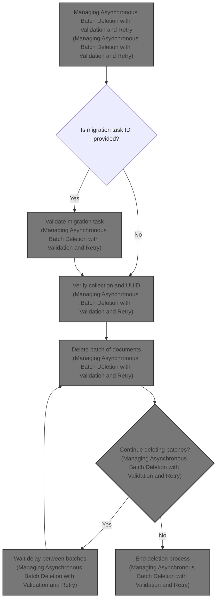
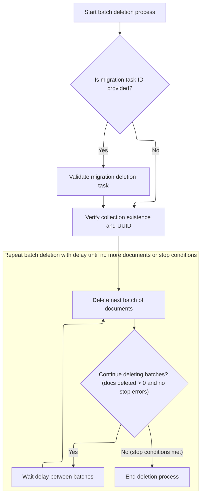
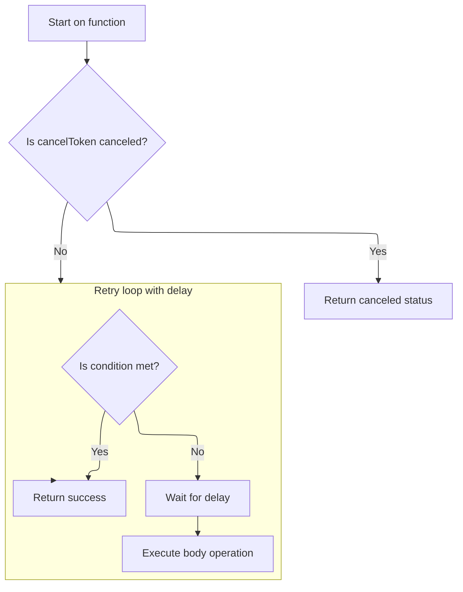

This document explains the flow of managing asynchronous batch deletion of documents within a specified range in a <SwmToken path="src/mongo/db/s/range_deletion_util.cpp" pos="2:13:13" line-data=" *    Copyright (C) 2020-present MongoDB, Inc.">`MongoDB`</SwmToken> collection. The flow receives parameters defining the collection, range, and batch deletion settings as input, and completes when all documents in the range are deleted or stop conditions occur. It validates the migration task if provided, verifies the collection state, deletes documents in batches, and repeats the deletion with delays until completion or stop conditions.



# Managing Asynchronous Batch Deletion with Validation and Retry



This section manages asynchronous batch deletion of documents within a specified range in a <SwmToken path="src/mongo/db/s/range_deletion_util.cpp" pos="2:13:13" line-data=" *    Copyright (C) 2020-present MongoDB, Inc.">`MongoDB`</SwmToken> collection, ensuring validation of migration tasks and collection state, and retrying deletions with delays until completion or error conditions are met.

| Category        | Rule Name                                  | Description                                                                                                                                                                                                      |
| --------------- | ------------------------------------------ | ---------------------------------------------------------------------------------------------------------------------------------------------------------------------------------------------------------------- |
| Data validation | Migration Task Validation                  | Batch deletion must only proceed if the migration task ID is provided and validated to still exist, ensuring the deletion task is legitimate.                                                                    |
| Data validation | Collection Existence and UUID Verification | If no migration task ID is provided, the system must verify that the target collection exists and that its UUID matches the expected UUID to prevent deleting documents from an incorrect or dropped collection. |
| Business logic  | Iterative Batch Deletion                   | Batch deletions continue iteratively, deleting a specified number of documents per batch, until no documents remain in the specified range or a stop condition is met.                                           |
| Business logic  | Delay Between Batches                      | Between each batch deletion, the system must wait for a configured delay period before proceeding to the next batch to manage resource usage and system load.                                                    |

<SwmSnippet path="/src/mongo/db/s/range_deletion_util.cpp" line="296">

---

<SwmToken path="src/mongo/db/s/range_deletion_util.cpp" pos="296:5:5" line-data="ExecutorFuture&lt;void&gt; deleteRangeInBatches(const std::shared_ptr&lt;executor::TaskExecutor&gt;&amp; executor,">`deleteRangeInBatches`</SwmToken> runs batch deletions repeatedly with checks on collection state and migration task validity, retrying with delays until no documents remain or errors indicate to stop.

```c++
ExecutorFuture<void> deleteRangeInBatches(const std::shared_ptr<executor::TaskExecutor>& executor,
                                          const NamespaceString& nss,
                                          const UUID& collectionUuid,
                                          const BSONObj& keyPattern,
                                          const ChunkRange& range,
                                          const boost::optional<UUID>& migrationId,
                                          int numDocsToRemovePerBatch,
                                          Milliseconds delayBetweenBatches) {
    return AsyncTry([=] {
               return withTemporaryOperationContext([=](OperationContext* opCtx) {
                   LOGV2_DEBUG(5346200,
                               1,
                               "Starting batch deletion",
                               "namespace"_attr = nss,
                               "range"_attr = redact(range.toString()),
                               "numDocsToRemovePerBatch"_attr = numDocsToRemovePerBatch,
                               "delayBetweenBatches"_attr = delayBetweenBatches);

                   if (migrationId) {
                       ensureRangeDeletionTaskStillExists(opCtx, *migrationId);
                   }

                   AutoGetCollection collection(opCtx, nss, MODE_IX);

                   // Ensure the collection exists and has not been dropped or dropped and
                   // recreated.
                   uassert(
                       ErrorCodes::RangeDeletionAbandonedBecauseCollectionWithUUIDDoesNotExist,
                       "Collection has been dropped since enqueuing this range "
                       "deletion task. No need to delete documents.",
                       !collectionUuidHasChanged(nss, collection.getCollection(), collectionUuid));

                   auto numDeleted = uassertStatusOK(deleteNextBatch(opCtx,
                                                                     collection.getCollection(),
                                                                     keyPattern,
                                                                     range,
                                                                     numDocsToRemovePerBatch));

                   LOGV2_DEBUG(
                       23769,
                       1,
                       "Deleted {numDeleted} documents in pass in namespace {namespace} with "
                       "UUID  {collectionUUID} for range {range}",
                       "Deleted documents in pass",
                       "numDeleted"_attr = numDeleted,
                       "namespace"_attr = nss.ns(),
                       "collectionUUID"_attr = collectionUuid,
                       "range"_attr = range.toString());

                   return numDeleted;
               });
           })
        .until([](StatusWith<int> swNumDeleted) {
            // Continue iterating until there are no more documents to delete, retrying on
            // any error that doesn't indicate that this node is stepping down.
            return (swNumDeleted.isOK() && swNumDeleted.getValue() == 0) ||
                swNumDeleted.getStatus() ==
                ErrorCodes::RangeDeletionAbandonedBecauseCollectionWithUUIDDoesNotExist ||
                swNumDeleted.getStatus() ==
                ErrorCodes::RangeDeletionAbandonedBecauseTaskDocumentDoesNotExist ||
                swNumDeleted.getStatus().code() == ErrorCodes::KeyPatternShorterThanBound ||
                ErrorCodes::isShutdownError(swNumDeleted.getStatus()) ||
                ErrorCodes::isNotPrimaryError(swNumDeleted.getStatus());
        })
        .withDelayBetweenIterations(delayBetweenBatches)
        .on(executor, CancellationToken::uncancelable())
        .ignoreValue();
}
```

---

</SwmSnippet>

# Starting and Managing the Retry Loop Execution



This section describes the retry loop execution management in <SwmToken path="src/mongo/db/s/range_deletion_util.cpp" pos="2:13:13" line-data=" *    Copyright (C) 2020-present MongoDB, Inc.">`MongoDB`</SwmToken>'s utility functions, focusing on starting and managing a retry loop with delay, cancellation support, and condition-based termination.

| Category       | Rule Name                 | Description                                                                                                                                  |
| -------------- | ------------------------- | -------------------------------------------------------------------------------------------------------------------------------------------- |
| Business logic | Retry until condition met | The retry loop must repeatedly execute the body operation until the specified condition is met, ensuring the operation is retried as needed. |
| Business logic | Delay between retries     | Between each retry attempt, the loop must wait for a specified delay duration to avoid immediate repeated execution.                         |

<SwmSnippet path="/src/mongo/util/future_util.h" line="99">

---

The <SwmToken path="src/mongo/util/future_util.h" pos="99:3:3" line-data="    auto on(std::shared_ptr&lt;executor::TaskExecutor&gt; executor, CancellationToken cancelToken)&amp;&amp; {">`on`</SwmToken> function creates a <SwmToken path="src/mongo/util/future_util.h" pos="100:11:11" line-data="        auto loop = std::make_shared&lt;TryUntilLoopWithDelay&gt;(std::move(executor),">`TryUntilLoopWithDelay`</SwmToken> object that wraps the retry logic with delays. It sets up the executor, the task to run, the condition to stop, the delay between retries, and the cancellation token. Then it calls run() on this object to start the loop and return its future result. This abstracts the retry loop management into a reusable helper.

```c
    auto on(std::shared_ptr<executor::TaskExecutor> executor, CancellationToken cancelToken)&& {
        auto loop = std::make_shared<TryUntilLoopWithDelay>(std::move(executor),
                                                            std::move(_body),
                                                            std::move(_condition),
                                                            std::move(_delay),
                                                            std::move(cancelToken));
        // Launch the recursive chain using the helper class.
        return loop->run();
    }
```

---

</SwmSnippet>

<SwmSnippet path="/src/mongo/util/future_util.h" line="129">

---

<SwmToken path="src/mongo/util/future_util.h" pos="129:8:8" line-data="        ExecutorFuture&lt;FutureContinuationResult&lt;BodyCallable&gt;&gt; run() {">`run`</SwmToken> avoids starting if canceled, kicks off async loop with <SwmToken path="src/mongo/util/future_util.h" pos="139:1:1" line-data="            runImpl(std::move(promise));">`runImpl`</SwmToken>, and returns a future scheduled on the executor.

```c
        ExecutorFuture<FutureContinuationResult<BodyCallable>> run() {
            using ReturnType = FutureContinuationResult<BodyCallable>;

            // If the request is already canceled, don't run anything.
            if (cancelToken.isCanceled())
                return ExecutorFuture<ReturnType>(executor, asyncTryCanceledStatus());

            auto [promise, future] = makePromiseFuture<ReturnType>();

            // Kick off the asynchronous loop.
            runImpl(std::move(promise));

            return std::move(future).thenRunOn(executor);
        }
```

---

</SwmSnippet>

&nbsp;

*This is an auto-generated document by Swimm 🌊 and has not yet been verified by a human*

<SwmMeta version="3.0.0" repo-id="Z2l0aHViJTNBJTNBTW9uZ29EQkMtJTNBJTNBdW1hbGluZ2Fzd2FtaQ==" repo-name="MongoDBC-"><sup>Powered by [Swimm](https://app.swimm.io/)</sup></SwmMeta>
