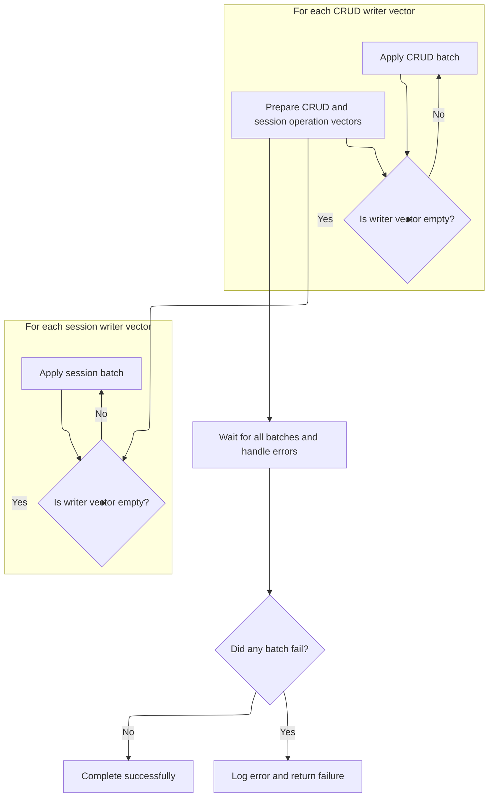
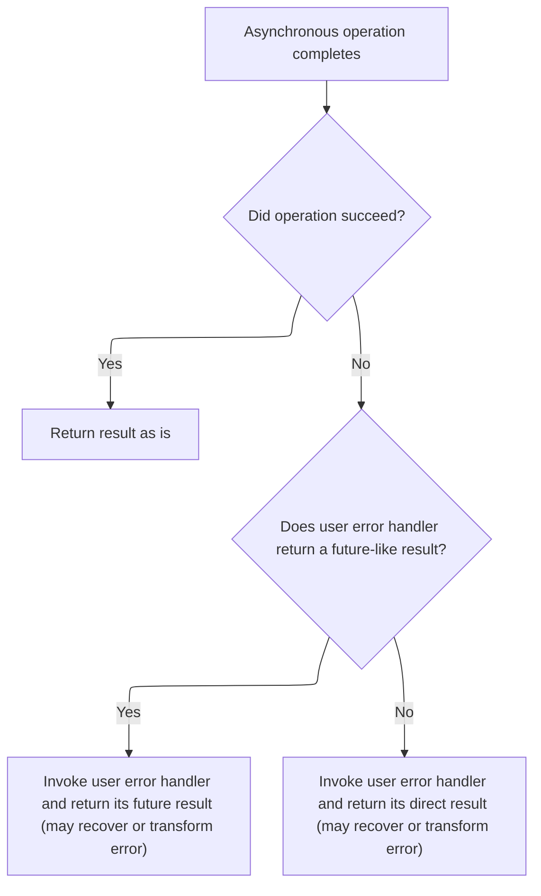

This document describes how batches of database operations are applied concurrently to support efficient resharding. CRUD and session operations are grouped and processed in parallel, with the outcome reflecting whether all operations succeeded or if any errors occurred.

# Applying Operation Batches Concurrently



<SwmSnippet path="/src/mongo/db/s/resharding/resharding_oplog_applier.cpp" line="73">

---

In <SwmToken path="src/mongo/db/s/resharding/resharding_oplog_applier.cpp" pos="73:7:7" line-data="SemiFuture&lt;void&gt; ReshardingOplogApplier::_applyBatch(">`_applyBatch`</SwmToken> we kick off the batch application by preparing vectors for CRUD operations and session operations. We set up a cancellation source to handle errors, reserve space for the futures, and start applying <SwmToken path="src/mongo/util/future_impl.h" pos="346:14:16" line-data="    // on it, or children is non-empty. Either way, the completer of the promise must acquire the">`non-empty`</SwmToken> CRUD batches asynchronously. This sets up the concurrent execution and error handling for the rest of the flow.

```c++
SemiFuture<void> ReshardingOplogApplier::_applyBatch(
    std::shared_ptr<executor::TaskExecutor> executor,
    CancellationToken cancelToken,
    CancelableOperationContextFactory factory) {
    auto crudWriterVectors =
        _batchPreparer.makeCrudOpWriterVectors(_currentBatchToApply, _currentDerivedOps);

    CancellationSource errorSource(cancelToken);

    std::vector<SharedSemiFuture<void>> batchApplierFutures;
    // Use `2 * crudWriterVectors.size()` because sessionWriterVectors.size() is very likely equal
    // to crudWriterVectors.size(). Calling ReshardingOplogBatchApplier::applyBatch<false>() first
    // though allows CRUD application to be concurrent with preparing the writer vectors for session
    // application in addition to being concurrent with session application itself.
    batchApplierFutures.reserve(2 * crudWriterVectors.size());

    for (auto&& writer : crudWriterVectors) {
        if (!writer.empty()) {
            batchApplierFutures.emplace_back(
                _batchApplier
                    .applyBatch<false>(std::move(writer), executor, errorSource.token(), factory)
                    .share());
        }
    }
```

---

</SwmSnippet>

<SwmSnippet path="/src/mongo/db/s/resharding/resharding_oplog_applier.cpp" line="98">

---

We set up session batch applications in parallel, using a flag to route them through the right logic.

```c++
    auto sessionWriterVectors = _batchPreparer.makeSessionOpWriterVectors(_currentBatchToApply);
    batchApplierFutures.reserve(crudWriterVectors.size() + sessionWriterVectors.size());

    for (auto&& writer : sessionWriterVectors) {
        if (!writer.empty()) {
            batchApplierFutures.emplace_back(
                _batchApplier
                    .applyBatch<true>(std::move(writer), executor, errorSource.token(), factory)
                    .share());
        }
    }

```

---

</SwmSnippet>

<SwmSnippet path="/src/mongo/db/s/resharding/resharding_oplog_batch_applier.cpp" line="51">

---

<SwmToken path="src/mongo/db/s/resharding/resharding_oplog_batch_applier.cpp" pos="51:7:7" line-data="SemiFuture&lt;void&gt; ReshardingOplogBatchApplier::applyBatch(">`applyBatch`</SwmToken> handles the actual application of each batch, using a compile-time flag to route between session and CRUD logic. It tracks progress with <SwmToken path="src/mongo/db/s/resharding/resharding_oplog_batch_applier.cpp" pos="56:3:3" line-data="    struct ChainContext {">`ChainContext`</SwmToken> and retries from the last failed entry if needed, so only unprocessed operations are retried.

```c++
SemiFuture<void> ReshardingOplogBatchApplier::applyBatch(
    OplogBatch batch,
    std::shared_ptr<executor::TaskExecutor> executor,
    CancellationToken cancelToken,
    CancelableOperationContextFactory factory) const {
    struct ChainContext {
        OplogBatch batch;
        size_t nextToApply = 0;
    };

    auto chainCtx = std::make_shared<ChainContext>();
    chainCtx->batch = std::move(batch);

    return resharding::WithAutomaticRetry<unique_function<SemiFuture<void>()>>(
               [this, chainCtx, cancelToken, factory] {
                   // Writing `auto& i = chainCtx->nextToApply` takes care of incrementing
                   // chainCtx->nextToApply on each loop iteration.
                   for (auto& i = chainCtx->nextToApply; i < chainCtx->batch.size(); ++i) {
                       const auto& oplogEntry = *chainCtx->batch[i];
                       auto opCtx = factory.makeOperationContext(&cc());

                       if constexpr (IsForSessionApplication) {
                           auto hitPreparedTxn =
                               _sessionApplication.tryApplyOperation(opCtx.get(), oplogEntry);

                           if (hitPreparedTxn) {
                               return future_util::withCancellation(std::move(*hitPreparedTxn),
                                                                    cancelToken);
                           }
                       } else {
                           uassertStatusOK(
                               _crudApplication.applyOperation(opCtx.get(), oplogEntry));
                       }
                   }
```

---

</SwmSnippet>

<SwmSnippet path="/src/mongo/db/s/resharding/resharding_oplog_applier.cpp" line="110">

---

Back in <SwmToken path="src/mongo/db/s/resharding/resharding_oplog_applier.cpp" pos="73:7:7" line-data="SemiFuture&lt;void&gt; ReshardingOplogApplier::_applyBatch(">`_applyBatch`</SwmToken>, after launching all batch applications, we wait for all futures to finish or cancel on error. We use <SwmToken path="src/mongo/db/s/resharding/resharding_oplog_applier.cpp" pos="110:5:5" line-data="    return resharding::cancelWhenAnyErrorThenQuiesce(batchApplierFutures, executor, errorSource)">`cancelWhenAnyErrorThenQuiesce`</SwmToken> to coordinate error handling and quiescing, then pass errors to the next handler.

```c++
    return resharding::cancelWhenAnyErrorThenQuiesce(batchApplierFutures, executor, errorSource)
        .onError([](Status status) {
            LOGV2_ERROR(
                5012004, "Failed to apply operation in resharding", "error"_attr = redact(status));
            return status;
        })
        .semi();
}
```

---

</SwmSnippet>

# Error Handling and Result Propagation



<SwmSnippet path="/src/mongo/util/future_impl.h" line="1020">

---

<SwmToken path="src/mongo/util/future_impl.h" pos="1020:8:8" line-data="        FutureImpl&lt;FakeVoidToVoid&lt;T&gt;&gt; onError(Func&amp;&amp; func) &amp;&amp; noexcept {">`onError`</SwmToken> sets up error handling for the future. It normalizes the error handler's return type, branches based on whether it's Future-like, and creates continuations to handle both immediate and deferred error recovery.

```c
        FutureImpl<FakeVoidToVoid<T>> onError(Func&& func) && noexcept {
        using Result = NormalizedCallResult<Func, Status>;
        static_assert(
            std::is_same<VoidToFakeVoid<UnwrappedType<Result>>, T>::value,
            "func passed to Future<T>::onError must return T, StatusWith<T>, or Future<T>");

        if constexpr (!isFutureLike<Result>) {
            return generalImpl(
                // on ready success:
                [&](T&& val) { return FutureImpl<T>::makeReady(std::move(val)); },
                // on ready failure:
                [&](Status&& status) {
                    return FutureImpl<T>::makeReady(statusCall(func, std::move(status)));
                },
                // on not ready yet:
                [&] {
                    return makeContinuation<T>([func = std::forward<Func>(func)](
                        SharedState<T> * input, SharedState<T> * output) mutable noexcept {
                        if (input->status.isOK())
                            return output->emplaceValue(std::move(*input->data));

                        output->setFrom(statusCall(func, std::move(input->status)));
                    });
                });
        } else {
            return generalImpl(
                // on ready success:
                [&](T&& val) { return FutureImpl<T>::makeReady(std::move(val)); },
                // on ready failure:
                [&](Status&& status) {
                    try {
                        return FutureImpl<T>(throwingCall(func, std::move(status)));
                    } catch (const DBException& ex) {
                        return FutureImpl<T>::makeReady(ex.toStatus());
                    }
                },
                // on not ready yet:
                [&] {
                    return makeContinuation<T>([func = std::forward<Func>(func)](
                        SharedState<T> * input, SharedState<T> * output) mutable noexcept {
                        if (input->status.isOK())
                            return output->emplaceValue(std::move(*input->data));

                        try {
                            throwingCall(func, std::move(input->status)).propagateResultTo(output);
                        } catch (const DBException& ex) {
                            output->setError(ex.toStatus());
                        }
                    });
                });
        }
    }
```

---

</SwmSnippet>

<SwmSnippet path="/src/mongo/util/future_impl.h" line="1143">

---

<SwmToken path="src/mongo/util/future_impl.h" pos="1143:3:3" line-data="    void propagateResultTo(SharedState&lt;T&gt;* output) &amp;&amp; noexcept {">`propagateResultTo`</SwmToken> handles moving the result from one shared state to another, using atomic flags and continuation pointers to synchronize between Future and Promise sides. It sets up a callback for asynchronous propagation when the state isn't ready.

```c
    void propagateResultTo(SharedState<T>* output) && noexcept {
        generalImpl(
            // on ready success:
            [&](T&& val) { output->emplaceValue(std::move(val)); },
            // on ready failure:
            [&](Status&& status) { output->setError(std::move(status)); },
            // on not ready yet:
            [&] {
                // If the output is just for continuation, bypass it and just directly fill in the
                // SharedState that it would write to. The concurrency situation is a bit subtle
                // here since we are the Future-side of shared, but the Promise-side of output.
                // The rule is that p->isJustForContinuation must be acquire-read as true before
                // examining p->continuation, and p->continuation must be written before doing the
                // release-store of true to p->isJustForContinuation.
                if (output->isJustForContinuation.load(std::memory_order_acquire)) {
                    _shared->continuation = std::move(output->continuation);
                } else {
                    _shared->continuation = output;
                }
                _shared->isJustForContinuation.store(true, std::memory_order_release);

                _shared->callback = [](SharedStateBase * ssb) noexcept {
                    const auto input = checked_cast<SharedState<T>*>(ssb);
                    const auto output = checked_cast<SharedState<T>*>(ssb->continuation.get());
                    output->fillFromMove(std::move(*input));
                };
            });
    }
```

---

</SwmSnippet>

&nbsp;

*This is an auto-generated document by Swimm 🌊 and has not yet been verified by a human*

<SwmMeta version="3.0.0" repo-id="Z2l0aHViJTNBJTNBTW9uZ29EQkMtJTNBJTNBdW1hbGluZ2Fzd2FtaQ==" repo-name="MongoDBC-"><sup>Powered by [Swimm](https://app.swimm.io/)</sup></SwmMeta>
