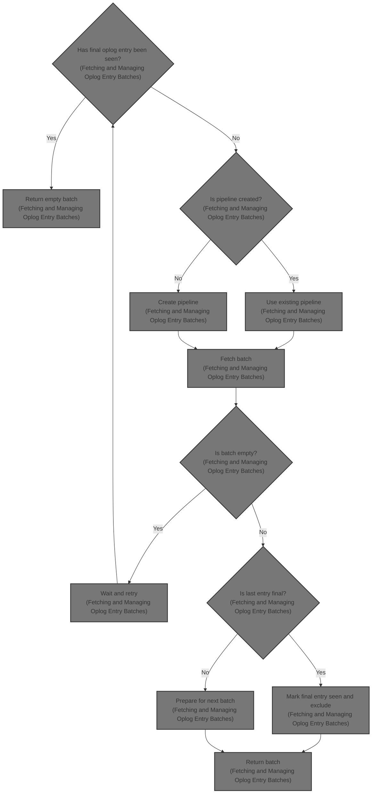

This document explains the flow of fetching and managing batches of oplog entries during resharding. It describes how pipelines are created or reused to fetch data, how the final oplog entry is detected to end iteration, and how the system waits asynchronously for new inserts to maintain continuous data retrieval.



# Fetching and Managing Oplog Entry Batches

```mermaid
%%{init: {"flowchart": {"defaultRenderer": "elk"}} }%%
flowchart TD
    node1{"Has final oplog entry been seen?"}
    click node1 openCode "src/mongo/db/s/resharding/resharding_donor_oplog_iterator.cpp:201:204"
    node1 -->|"Yes"| node2["Return empty batch"]
    click node2 openCode "src/mongo/db/s/resharding/resharding_donor_oplog_iterator.cpp:203:204"
    node1 -->|"No"| node3{"Is pipeline created?"}
    click node3 openCode "src/mongo/db/s/resharding/resharding_donor_oplog_iterator.cpp:210:218"
    node3 -->|"Yes"| node4["Reattach pipeline to operation context"]
    click node4 openCode "src/mongo/db/s/resharding/resharding_donor_oplog_iterator.cpp:211:212"
    node3 -->|"No"| node5["Create and attach pipeline"]
    click node5 openCode "src/mongo/db/s/resharding/resharding_donor_oplog_iterator.cpp:213:217"
    node4 --> node6["Fill batch from pipeline"]
    node5 --> node6
    click node6 openCode "src/mongo/db/s/resharding/resharding_donor_oplog_iterator.cpp:220:234"
    node6 --> node7{"Is batch empty?"}
    click node7 openCode "src/mongo/db/s/resharding/resharding_donor_oplog_iterator.cpp:222:239"
    node7 -->|"Yes"| node8["Wait for new inserts and retry"]
    click node8 openCode "src/mongo/db/s/resharding/resharding_donor_oplog_iterator.cpp:240:247"
    node7 -->|"No"| node9{"Is last entry final oplog entry?"}
    click node9 openCode "src/mongo/db/s/resharding/resharding_donor_oplog_iterator.cpp:223:230"
    node9 -->|"Yes"| node10["Mark final entry seen and remove it"]
    click node10 openCode "src/mongo/db/s/resharding/resharding_donor_oplog_iterator.cpp:226:230"
    node9 -->|"No"| node11["Detach pipeline and prepare for next"]
    click node11 openCode "src/mongo/db/s/resharding/resharding_donor_oplog_iterator.cpp:231:233"
    node10 --> node12["Return batch without final entry"]
    node12["Return batch without final entry"] -->|"Batch returned"| end
    click node12 openCode "src/mongo/db/s/resharding/resharding_donor_oplog_iterator.cpp:236:237"
    node11 --> node12
    node8 --> node1
classDef HeadingStyle fill:#777777,stroke:#333,stroke-width:2px;

%% Swimm:
%% %%{init: {"flowchart": {"defaultRenderer": "elk"}} }%%
%% flowchart TD
%%     node1{"Has final oplog entry been seen?"}
%%     click node1 openCode "<SwmPath>[src/…/resharding/resharding_donor_oplog_iterator.cpp](src/mongo/db/s/resharding/resharding_donor_oplog_iterator.cpp)</SwmPath>:201:204"
%%     node1 -->|"Yes"| node2["Return empty batch"]
%%     click node2 openCode "<SwmPath>[src/…/resharding/resharding_donor_oplog_iterator.cpp](src/mongo/db/s/resharding/resharding_donor_oplog_iterator.cpp)</SwmPath>:203:204"
%%     node1 -->|"No"| node3{"Is pipeline created?"}
%%     click node3 openCode "<SwmPath>[src/…/resharding/resharding_donor_oplog_iterator.cpp](src/mongo/db/s/resharding/resharding_donor_oplog_iterator.cpp)</SwmPath>:210:218"
%%     node3 -->|"Yes"| node4["Reattach pipeline to operation context"]
%%     click node4 openCode "<SwmPath>[src/…/resharding/resharding_donor_oplog_iterator.cpp](src/mongo/db/s/resharding/resharding_donor_oplog_iterator.cpp)</SwmPath>:211:212"
%%     node3 -->|"No"| node5["Create and attach pipeline"]
%%     click node5 openCode "<SwmPath>[src/…/resharding/resharding_donor_oplog_iterator.cpp](src/mongo/db/s/resharding/resharding_donor_oplog_iterator.cpp)</SwmPath>:213:217"
%%     node4 --> node6["Fill batch from pipeline"]
%%     node5 --> node6
%%     click node6 openCode "<SwmPath>[src/…/resharding/resharding_donor_oplog_iterator.cpp](src/mongo/db/s/resharding/resharding_donor_oplog_iterator.cpp)</SwmPath>:220:234"
%%     node6 --> node7{"Is batch empty?"}
%%     click node7 openCode "<SwmPath>[src/…/resharding/resharding_donor_oplog_iterator.cpp](src/mongo/db/s/resharding/resharding_donor_oplog_iterator.cpp)</SwmPath>:222:239"
%%     node7 -->|"Yes"| node8["Wait for new inserts and retry"]
%%     click node8 openCode "<SwmPath>[src/…/resharding/resharding_donor_oplog_iterator.cpp](src/mongo/db/s/resharding/resharding_donor_oplog_iterator.cpp)</SwmPath>:240:247"
%%     node7 -->|"No"| node9{"Is last entry final oplog entry?"}
%%     click node9 openCode "<SwmPath>[src/…/resharding/resharding_donor_oplog_iterator.cpp](src/mongo/db/s/resharding/resharding_donor_oplog_iterator.cpp)</SwmPath>:223:230"
%%     node9 -->|"Yes"| node10["Mark final entry seen and remove it"]
%%     click node10 openCode "<SwmPath>[src/…/resharding/resharding_donor_oplog_iterator.cpp](src/mongo/db/s/resharding/resharding_donor_oplog_iterator.cpp)</SwmPath>:226:230"
%%     node9 -->|"No"| node11["Detach pipeline and prepare for next"]
%%     click node11 openCode "<SwmPath>[src/…/resharding/resharding_donor_oplog_iterator.cpp](src/mongo/db/s/resharding/resharding_donor_oplog_iterator.cpp)</SwmPath>:231:233"
%%     node10 --> node12["Return batch without final entry"]
%%     node12["Return batch without final entry"] -->|"Batch returned"| end
%%     click node12 openCode "<SwmPath>[src/…/resharding/resharding_donor_oplog_iterator.cpp](src/mongo/db/s/resharding/resharding_donor_oplog_iterator.cpp)</SwmPath>:236:237"
%%     node11 --> node12
%%     node8 --> node1
%% classDef HeadingStyle fill:#777777,stroke:#333,stroke-width:2px;
```

This section describes the process of fetching and managing batches of oplog entries during resharding in <SwmToken path="src/mongo/db/s/resharding/resharding_donor_oplog_iterator.cpp" pos="2:13:13" line-data=" *    Copyright (C) 2020-present MongoDB, Inc.">`MongoDB`</SwmToken>. It handles the creation and reuse of pipelines, detection of the final oplog entry, and asynchronous waiting for new entries to ensure continuous and non-blocking data retrieval.

| Category       | Rule Name                        | Description                                                                                                                                                                                                                                                                                                                                                        |
| -------------- | -------------------------------- | ------------------------------------------------------------------------------------------------------------------------------------------------------------------------------------------------------------------------------------------------------------------------------------------------------------------------------------------------------------------ |
| Business logic | Final oplog entry exclusion      | If the final oplog entry is detected in the batch, it must be excluded from the returned batch as it is a <SwmToken path="src/mongo/db/s/resharding/resharding_donor_oplog_iterator.cpp" pos="228:29:31" line-data="                // Skip returning the final oplog entry because it is known to be a no-op.">`no-op`</SwmToken> and marks the end of iteration. |
| Business logic | Batch return on final entry seen | Once the final oplog entry has been seen and processed, subsequent calls must return an empty batch to indicate no more data is available.                                                                                                                                                                                                                         |
| Business logic | Wait and retry on empty batch    | If no oplog entries are fetched and the final entry has not been seen, the system must wait asynchronously for new inserts before retrying to fetch the next batch.                                                                                                                                                                                                |

<SwmSnippet path="/src/mongo/db/s/resharding/resharding_donor_oplog_iterator.cpp" line="197">

---

<SwmToken path="src/mongo/db/s/resharding/resharding_donor_oplog_iterator.cpp" pos="197:13:13" line-data="ExecutorFuture&lt;std::vector&lt;repl::OplogEntry&gt;&gt; ReshardingDonorOplogIterator::getNextBatch(">`getNextBatch`</SwmToken> starts the flow by either reusing or creating a pipeline to fetch oplog entries. It handles the final oplog entry by detecting and removing it from the batch since it's a <SwmToken path="src/mongo/db/s/resharding/resharding_donor_oplog_iterator.cpp" pos="228:29:31" line-data="                // Skip returning the final oplog entry because it is known to be a no-op.">`no-op`</SwmToken>, marking the iteration as complete. If no entries are fetched and the final entry hasn't been seen, it waits asynchronously for new inserts using a notifier, then recursively fetches again. This keeps the flow non-blocking and responsive to new data.

```c++
ExecutorFuture<std::vector<repl::OplogEntry>> ReshardingDonorOplogIterator::getNextBatch(
    std::shared_ptr<executor::TaskExecutor> executor,
    CancellationToken cancelToken,
    CancelableOperationContextFactory factory) {
    if (_hasSeenFinalOplogEntry) {
        invariant(!_pipeline);
        return ExecutorFuture(std::move(executor), std::vector<repl::OplogEntry>{});
    }

    auto batch = [&] {
        auto opCtx = factory.makeOperationContext(&cc());
        auto guard = makeGuard([&] { dispose(opCtx.get()); });

        if (_pipeline) {
            _pipeline->reattachToOperationContext(opCtx.get());
        } else {
            auto pipeline = makePipeline(opCtx.get(), MongoProcessInterface::create(opCtx.get()));
            _pipeline = pipeline->getContext()
                            ->mongoProcessInterface->attachCursorSourceToPipelineForLocalRead(
                                pipeline.release());
            _pipeline.get_deleter().dismissDisposal();
        }

        auto batch = _fillBatch(*_pipeline);

        if (!batch.empty()) {
            const auto& lastEntryInBatch = batch.back();
            _resumeToken = getId(lastEntryInBatch);

            if (isFinalOplog(lastEntryInBatch)) {
                _hasSeenFinalOplogEntry = true;
                // Skip returning the final oplog entry because it is known to be a no-op.
                batch.pop_back();
            } else {
                _pipeline->detachFromOperationContext();
                guard.dismiss();
            }
        }

        return batch;
    }();

    if (batch.empty() && !_hasSeenFinalOplogEntry) {
        return ExecutorFuture(executor)
            .then([this, cancelToken] {
                return future_util::withCancellation(_insertNotifier->awaitInsert(_resumeToken),
                                                     cancelToken);
            })
            .then([this, cancelToken, executor, factory] {
                return getNextBatch(std::move(executor), cancelToken, factory);
            });
    }

    return ExecutorFuture(std::move(executor), std::move(batch));
}
```

---

</SwmSnippet>

&nbsp;

*This is an auto-generated document by Swimm 🌊 and has not yet been verified by a human*

<SwmMeta version="3.0.0" repo-id="Z2l0aHViJTNBJTNBTW9uZ29EQkMtJTNBJTNBdW1hbGluZ2Fzd2FtaQ==" repo-name="MongoDBC-"><sup>Powered by [Swimm](https://app.swimm.io/)</sup></SwmMeta>
