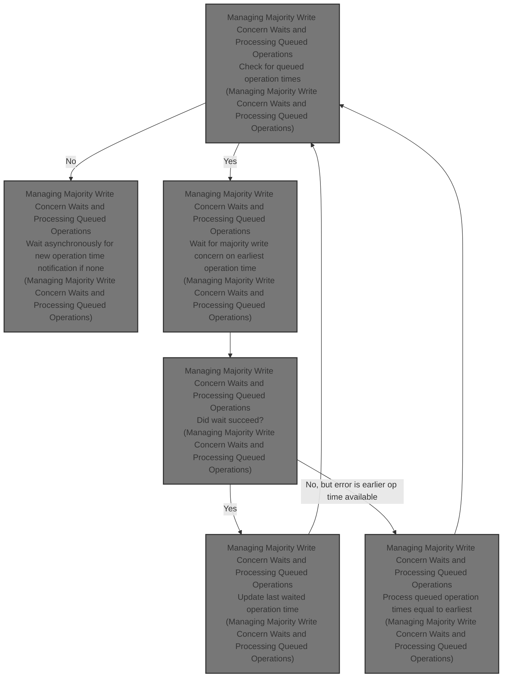
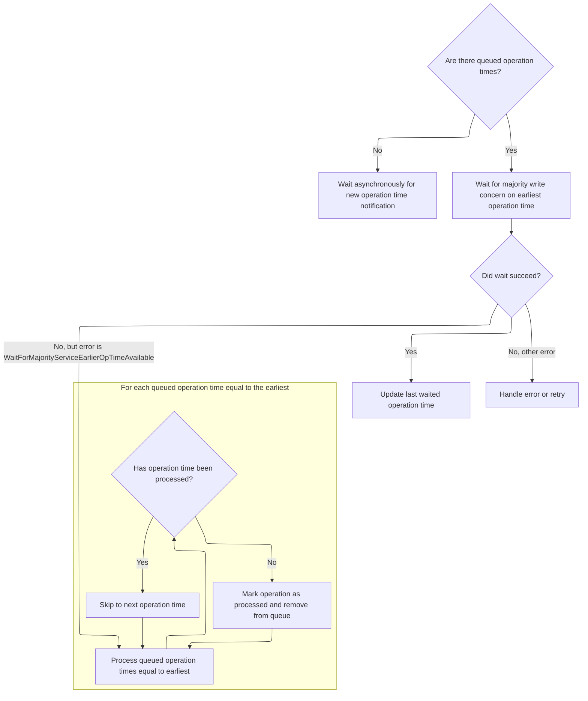

This document explains the flow of managing majority write concern waits and processing queued operation times. The flow waits for the earliest queued operation time to be confirmed with majority write concern, processes the operations, and updates the last waited operation time. It runs continuously until shutdown to ensure data durability and consistency.



# Managing Majority Write Concern Waits and Processing Queued Operations



This section manages the waiting for majority write concern on queued operation times and processes those operations once the write concern is satisfied or an error occurs.

| Category        | Rule Name                           | Description                                                                                                                                                    |
| --------------- | ----------------------------------- | -------------------------------------------------------------------------------------------------------------------------------------------------------------- |
| Data validation | Idempotent processing of operations | Each queued operation time equal to the earliest is checked to ensure it has not been processed before marking it as processed and removing it from the queue. |
| Business logic  | Wait for earliest operation time    | When there are queued operation times, the system waits for the majority write concern on the earliest operation time before processing.                       |
| Business logic  | Update last waited operation time   | If the wait for majority write concern succeeds, the system updates the last waited operation time to the current earliest operation time.                     |
| Business logic  | Continuous processing loop          | The processing loop runs continuously until the system is shut down, ensuring all queued operations are eventually handled.                                    |

<SwmSnippet path="/src/mongo/db/repl/wait_for_majority_service.cpp" line="185">

---

We start the flow by binding a client from <SwmToken path="src/mongo/db/repl/wait_for_majority_service.cpp" pos="187:7:7" line-data="               auto clientGuard = _waitForMajorityClient-&gt;bind();">`_waitForMajorityClient`</SwmToken> to create an operation context for waiting on write concern asynchronously. The function checks if there are any queued operation times; if none, it waits on a condition variable. If there are queued times, it picks the lowest one, unlocks the mutex to wait for the majority write concern on that operation time, then locks the mutex again to process all requests with that operation time. It marks requests as processed, sets their results, and removes them from the queue. This loop runs continuously until shutdown.

```c++
SemiFuture<void> WaitForMajorityService::_periodicallyWaitForMajority() {
    return AsyncTry([this] {
               auto clientGuard = _waitForMajorityClient->bind();
               stdx::unique_lock<Latch> lk(_mutex);
               if (_queuedOpTimes.empty()) {
                   return _hasNewOpTimeCV.onNotify();
               }
               auto opCtx = clientGuard->makeOperationContext();

               // This needs to be a copy since we unlock the lock before waiting for write concern
               // and the iterator could be invalidated.
               auto lowestOpTime = _queuedOpTimes.begin()->first;

               lk.unlock();

               WriteConcernResult ignoreResult;
               auto status = waitForWriteConcern(
                   opCtx.get(), lowestOpTime, kMajorityWriteConcern, &ignoreResult);

               lk.lock();

               if (status.isOK()) {
                   _lastOpTimeWaited = lowestOpTime;
               }

               if (status != ErrorCodes::WaitForMajorityServiceEarlierOpTimeAvailable) {
                   auto [lowestOpTimeIter, firstElemWithHigherOpTimeIter] =
                       _queuedOpTimes.equal_range(lowestOpTime);

                   for (auto requestIt = lowestOpTimeIter;
                        requestIt != firstElemWithHigherOpTimeIter;
                        /*Increment in loop*/) {
                       if (!requestIt->second->hasBeenProcessed.swap(true)) {
                           requestIt->second->result.setFrom(status);
                           requestIt = _queuedOpTimes.erase(requestIt);
                       } else {
                           ++requestIt;
                       }
                   }
```

---

</SwmSnippet>

&nbsp;

*This is an auto-generated document by Swimm 🌊 and has not yet been verified by a human*

<SwmMeta version="3.0.0" repo-id="Z2l0aHViJTNBJTNBTW9uZ29EQkMtJTNBJTNBdW1hbGluZ2Fzd2FtaQ==" repo-name="MongoDBC-"><sup>Powered by [Swimm](https://app.swimm.io/)</sup></SwmMeta>
