This document describes how the system processes and finalizes alarms as part of its scheduling and notification mechanism. When an alarm event occurs, the flow determines whether it should be processed and, if so, notifies the appropriate parties of its outcome.

# Processing and Finalizing Alarms

```mermaid
%%{init: {"flowchart": {"defaultRenderer": "elk"}} }%%
flowchart TD
  node1["Alarm triggered"]
  click node1 openCode "src/mongo/executor/network_interface_tl.cpp:1205:1209"
  node1 --> node2{"Was alarm canceled?"}
  click node2 openCode "src/mongo/executor/network_interface_tl.cpp:1209:1211"
  node2 -->|"Yes"| nodeEnd["Exit: Alarm not processed"]
  node2 -->|"No"| node3{"Is system shutting down?"}
  click node3 openCode "src/mongo/executor/network_interface_tl.cpp:1213:1216"
  node3 -->|"Yes"| nodeEnd
  node3 -->|"No"| node4{"Did alarm fire before scheduled time?"}
  click node4 openCode "src/mongo/executor/network_interface_tl.cpp:1221:1232"
  node4 -->|"Yes"| node1
  node4 -->|"No"| node5{"Is alarm still tracked?"}
  click node5 openCode "src/mongo/executor/network_interface_tl.cpp:1238:1241"
  node5 -->|"No"| nodeEnd
  node5 -->|"Yes"| node6{"Has alarm already been processed?"}
  click node6 openCode "src/mongo/executor/network_interface_tl.cpp:1246:1248"
  node6 -->|"Yes"| nodeEnd
  node6 -->|"No"| node7{"Did alarm complete successfully?"}
  click node7 openCode "src/mongo/executor/network_interface_tl.cpp:1253:1265"
  node7 -->|"No"| node8["Notify failure"]
  click node8 openCode "src/mongo/executor/network_interface_tl.cpp:1254:1255"
  node8 --> nodeEnd
  node7 -->|"Yes"| node9["Notify success"]
  click node9 openCode "src/mongo/executor/network_interface_tl.cpp:1259:1265"
  node9 --> nodeEnd
  click nodeEnd openCode "src/mongo/executor/network_interface_tl.cpp:1210:1266"
classDef HeadingStyle fill:#777777,stroke:#333,stroke-width:2px;

%% Swimm:
%% %%{init: {"flowchart": {"defaultRenderer": "elk"}} }%%
%% flowchart TD
%%   node1["Alarm triggered"]
%%   click node1 openCode "<SwmPath>[src/…/executor/network_interface_tl.cpp](src/mongo/executor/network_interface_tl.cpp)</SwmPath>:1205:1209"
%%   node1 --> node2{"Was alarm canceled?"}
%%   click node2 openCode "<SwmPath>[src/…/executor/network_interface_tl.cpp](src/mongo/executor/network_interface_tl.cpp)</SwmPath>:1209:1211"
%%   node2 -->|"Yes"| nodeEnd["Exit: Alarm not processed"]
%%   node2 -->|"No"| node3{"Is system shutting down?"}
%%   click node3 openCode "<SwmPath>[src/…/executor/network_interface_tl.cpp](src/mongo/executor/network_interface_tl.cpp)</SwmPath>:1213:1216"
%%   node3 -->|"Yes"| nodeEnd
%%   node3 -->|"No"| node4{"Did alarm fire before scheduled time?"}
%%   click node4 openCode "<SwmPath>[src/…/executor/network_interface_tl.cpp](src/mongo/executor/network_interface_tl.cpp)</SwmPath>:1221:1232"
%%   node4 -->|"Yes"| node1
%%   node4 -->|"No"| node5{"Is alarm still tracked?"}
%%   click node5 openCode "<SwmPath>[src/…/executor/network_interface_tl.cpp](src/mongo/executor/network_interface_tl.cpp)</SwmPath>:1238:1241"
%%   node5 -->|"No"| nodeEnd
%%   node5 -->|"Yes"| node6{"Has alarm already been processed?"}
%%   click node6 openCode "<SwmPath>[src/…/executor/network_interface_tl.cpp](src/mongo/executor/network_interface_tl.cpp)</SwmPath>:1246:1248"
%%   node6 -->|"Yes"| nodeEnd
%%   node6 -->|"No"| node7{"Did alarm complete successfully?"}
%%   click node7 openCode "<SwmPath>[src/…/executor/network_interface_tl.cpp](src/mongo/executor/network_interface_tl.cpp)</SwmPath>:1253:1265"
%%   node7 -->|"No"| node8["Notify failure"]
%%   click node8 openCode "<SwmPath>[src/…/executor/network_interface_tl.cpp](src/mongo/executor/network_interface_tl.cpp)</SwmPath>:1254:1255"
%%   node8 --> nodeEnd
%%   node7 -->|"Yes"| node9["Notify success"]
%%   click node9 openCode "<SwmPath>[src/…/executor/network_interface_tl.cpp](src/mongo/executor/network_interface_tl.cpp)</SwmPath>:1259:1265"
%%   node9 --> nodeEnd
%%   click nodeEnd openCode "<SwmPath>[src/…/executor/network_interface_tl.cpp](src/mongo/executor/network_interface_tl.cpp)</SwmPath>:1210:1266"
%% classDef HeadingStyle fill:#777777,stroke:#333,stroke-width:2px;
```



<SwmSnippet path="/src/mongo/executor/network_interface_tl.cpp" line="1205">

---

<SwmToken path="src/mongo/executor/network_interface_tl.cpp" pos="1205:4:4" line-data="void NetworkInterfaceTL::_answerAlarm(Status status, std::shared_ptr&lt;AlarmState&gt; state) {">`_answerAlarm`</SwmToken> kicks off alarm processing by first bailing out if the alarm was canceled or the system is shutting down. If the alarm fired early, it reschedules itself to wait until the right time. Once it's ready, it grabs a lock to safely remove itself from the in-progress alarms map, checks an atomic flag to avoid double-processing, and then either fulfills or errors the promise—making sure to do this on the reactor thread for proper context.

```c++
void NetworkInterfaceTL::_answerAlarm(Status status, std::shared_ptr<AlarmState> state) {
    // Since the lock is released before canceling the timer, this thread can win the race with
    // cancelAlarm(). Thus if status is CallbackCanceled, then this alarm is already removed from
    // _inProgressAlarms.
    if (ErrorCodes::isCancellationError(status)) {
        return;
    }

    if (inShutdown()) {
        // No alarms get processed in shutdown
        return;
    }

    // transport::Reactor timers do not involve spurious wake ups, however, this check is nearly
    // free and allows us to be resilient to a world where timers impls do have spurious wake ups.
    auto currentTime = now();
    if (status.isOK() && currentTime < state->when) {
        LOGV2_DEBUG(22600,
                    2,
                    "Alarm returned early",
                    "expectedTime"_attr = state->when,
                    "currentTime"_attr = currentTime);
        state->timer->waitUntil(state->when, nullptr)
            .getAsync([this, state = std::move(state)](Status status) mutable {
                _answerAlarm(status, state);
            });
        return;
    }

    // Erase the AlarmState from the map.
    {
        stdx::lock_guard<Latch> lk(_inProgressMutex);

        auto iter = _inProgressAlarms.find(state->cbHandle);
        if (iter == _inProgressAlarms.end()) {
            return;
        }

        _inProgressAlarms.erase(iter);
    }

    if (state->done.swap(true)) {
        return;
    }

    // A not OK status here means the timer experienced a system error.
    // It is not reasonable to complete the promise on a reactor thread because there is likely no
    // properly functioning reactor.
    if (!status.isOK()) {
        state->promise.setError(status);
        return;
    }

    // Fulfill the promise on a reactor thread
    _reactor->schedule([state](auto status) {
        if (status.isOK()) {
            state->promise.emplaceValue();
        } else {
            state->promise.setError(status);
        }
    });
}
```

---

</SwmSnippet>

&nbsp;

*This is an auto-generated document by Swimm 🌊 and has not yet been verified by a human*

<SwmMeta version="3.0.0" repo-id="Z2l0aHViJTNBJTNBTW9uZ29EQkMtJTNBJTNBdW1hbGluZ2Fzd2FtaQ==" repo-name="MongoDBC-"><sup>Powered by [Swimm](https://app.swimm.io/)</sup></SwmMeta>
