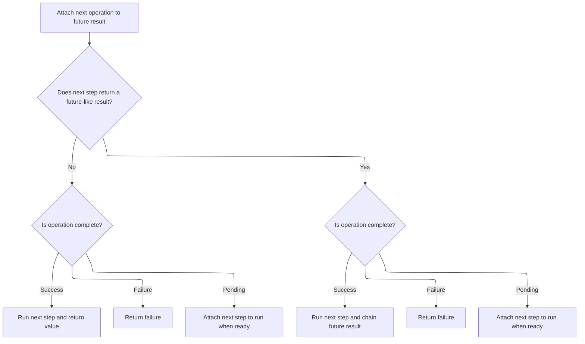

This document outlines the process for scheduling and executing remote work requests, ensuring that commands are sent to the appropriate shard and that results are handled asynchronously. The system determines whether to execute the command locally or remotely, schedules the command, and sets up asynchronous result handling for further processing.

# Locking and Scheduling Remote Work

<SwmSnippet path="/src/mongo/db/s/transaction_coordinator_futures_util.cpp" line="157">

---

In <SwmToken path="src/mongo/db/s/transaction_coordinator_futures_util.cpp" pos="153:8:8" line-data="            stdx::unique_lock&lt;Latch&gt; ul(_mutex);">`ul`</SwmToken>, we acquire a lock on the coordinator's mutex to make sure no other thread is messing with shared state while we schedule remote work. We need to call <SwmToken path="src/mongo/db/s/transaction_coordinator_futures_util.cpp" pos="157:5:5" line-data="                uassertStatusOK(_executor-&gt;scheduleRemoteCommand(request, [">`scheduleRemoteCommand`</SwmToken> next because that's where the actual remote command gets scheduled, and we want to do that while holding the lock to keep things consistent.

```c++
                                stdx::unique_lock<Latch> ul(_mutex);
```

---

</SwmSnippet>

<SwmSnippet path="/src/mongo/db/s/transaction_coordinator_futures_util.cpp" line="77">

---

<SwmToken path="src/mongo/db/s/transaction_coordinator_futures_util.cpp" pos="77:11:11" line-data="Future&lt;executor::TaskExecutor::ResponseStatus&gt; AsyncWorkScheduler::scheduleRemoteCommand(">`scheduleRemoteCommand`</SwmToken> handles three cases: it can inject failures for testing using fail points, it runs commands locally if the target is the local shard (to keep state changes sequential and avoid network hops), and for remote shards, it resolves the host, schedules the command asynchronously, and sets up a promise/future to handle the response. It also updates the replica set monitor with command and write concern status, and manages active command handles for cleanup.

```c++
Future<executor::TaskExecutor::ResponseStatus> AsyncWorkScheduler::scheduleRemoteCommand(
    const ShardId& shardId,
    const ReadPreferenceSetting& readPref,
    const BSONObj& commandObj,
    OperationContextFn operationContextFn) {

    const bool isSelfShard = (shardId == getLocalShardId(_serviceContext));

    int failPointErrorCode = 0;
    if (MONGO_unlikely(failRemoteTransactionCommand.shouldFail([&](const BSONObj& data) -> bool {
            invariant(data.hasField("code"));
            invariant(data.hasField("command"));
            failPointErrorCode = data.getIntField("code");
            if (commandObj.hasField(data.getStringField("command"))) {
                LOGV2_DEBUG(5141702,
                            1,
                            "Fail point matched the command and will inject failure",
                            "shardId"_attr = shardId,
                            "failData"_attr = data);
                return true;
            }
            return false;
        }))) {
        return ResponseStatus{BSON("code" << failPointErrorCode << "ok" << false << "errmsg"
                                          << "fail point"),
                              Milliseconds(1)};
    }

    if (isSelfShard) {
        // If sending a command to the same shard as this node is in, send it directly to this node
        // rather than going through the host targeting below. This ensures that the state changes
        // for the participant and coordinator occur sequentially on a single branch of replica set
        // history. See SERVER-38142 for details.
        return scheduleWork([this, shardId, operationContextFn, commandObj = commandObj.getOwned()](
                                OperationContext* opCtx) {
            operationContextFn(opCtx);

            // Note: This internal authorization is tied to the lifetime of the client, which will
            // be destroyed by 'scheduleWork' immediately after this lambda ends
            AuthorizationSession::get(opCtx->getClient())
                ->grantInternalAuthorization(opCtx->getClient());

            if (MONGO_unlikely(hangWhileTargetingLocalHost.shouldFail())) {
                LOGV2(22449, "Hit hangWhileTargetingLocalHost failpoint");
                hangWhileTargetingLocalHost.pauseWhileSet(opCtx);
            }

            const auto service = opCtx->getServiceContext();
            auto start = _executor->now();

            auto requestOpMsg =
                OpMsgRequest::fromDBAndBody(NamespaceString::kAdminDb, commandObj).serialize();
            const auto replyOpMsg = OpMsg::parseOwned(
                service->getServiceEntryPoint()->handleRequest(opCtx, requestOpMsg).get().response);

            // Document sequences are not yet being used for responses.
            invariant(replyOpMsg.sequences.empty());

            // 'ResponseStatus' is the response format of a remote request sent over the network
            // so we simulate that format manually here, since we sent the request over the
            // loopback.
            return ResponseStatus{replyOpMsg.body.getOwned(), _executor->now() - start};
        });
    }

    return _targetHostAsync(shardId, readPref, operationContextFn)
        .then([this, shardId, commandObj = commandObj.getOwned(), readPref](
                  HostAndShard hostAndShard) mutable {
            executor::RemoteCommandRequest request(hostAndShard.hostTargeted,
                                                   NamespaceString::kAdminDb.toString(),
                                                   commandObj,
                                                   readPref.toContainingBSON(),
                                                   nullptr);

            auto pf = makePromiseFuture<ResponseStatus>();

            stdx::unique_lock<Latch> ul(_mutex);
            uassertStatusOK(_shutdownStatus);

            auto scheduledCommandHandle =
                uassertStatusOK(_executor->scheduleRemoteCommand(request, [
                    this,
                    commandObj = std::move(commandObj),
                    shardId = std::move(shardId),
                    hostTargeted = std::move(hostAndShard.hostTargeted),
                    shard = std::move(hostAndShard.shard),
                    promise = std::make_shared<Promise<ResponseStatus>>(std::move(pf.promise))
                ](const RemoteCommandCallbackArgs& args) mutable noexcept {
                    auto status = args.response.status;
                    shard->updateReplSetMonitor(hostTargeted, status);

                    // Only consider actual failures to send the command as errors.
                    if (status.isOK()) {
                        auto commandStatus = getStatusFromCommandResult(args.response.data);
                        shard->updateReplSetMonitor(hostTargeted, commandStatus);

                        auto writeConcernStatus =
                            getWriteConcernStatusFromCommandResult(args.response.data);
                        shard->updateReplSetMonitor(hostTargeted, writeConcernStatus);

                        promise->emplaceValue(std::move(args.response));
                    } else {
                        promise->setError([&] {
                            if (status == ErrorCodes::CallbackCanceled) {
                                stdx::unique_lock<Latch> ul(_mutex);
                                return _shutdownStatus.isOK() ? status : _shutdownStatus;
                            }
                            return status;
                        }());
                    }
                }));

            auto it =
                _activeHandles.emplace(_activeHandles.begin(), std::move(scheduledCommandHandle));

            ul.unlock();

            return std::move(pf.future).tapAll(
                [this, it = std::move(it)](StatusWith<ResponseStatus> s) {
                    stdx::lock_guard<Latch> lg(_mutex);
                    _activeHandles.erase(it);
                    _notifyAllTasksComplete(lg);
                });
        });
}
```

---

</SwmSnippet>

<SwmSnippet path="/src/mongo/db/s/transaction_coordinator_futures_util.cpp" line="142">

---

After returning from <SwmToken path="src/mongo/db/s/transaction_coordinator_futures_util.cpp" pos="77:11:11" line-data="Future&lt;executor::TaskExecutor::ResponseStatus&gt; AsyncWorkScheduler::scheduleRemoteCommand(">`scheduleRemoteCommand`</SwmToken> in ul, we need to handle the async result. That's where <SwmPath>[src/…/util/future_impl.h](src/mongo/util/future_impl.h)</SwmPath> comes in—it lets us set up continuations to process the outcome once the remote command finishes.

```c++
                                stdx::unique_lock<Latch> ul(_mutex);
```

---

</SwmSnippet>

# Chaining and Propagating Async Results



<SwmSnippet path="/src/mongo/util/future_impl.h" line="891">

---

<SwmToken path="src/mongo/util/future_impl.h" pos="891:3:3" line-data="        auto then(Func&amp;&amp; func) &amp;&amp; noexcept {">`then`</SwmToken> sets up the next step to run when the future completes. It handles success, failure, and not-ready states, and if the result isn't ready, it arranges for the continuation to run later.

```c
        auto then(Func&& func) && noexcept {
        using Result = NormalizedCallResult<Func, T>;
        if constexpr (!isFutureLike<Result>) {
            return generalImpl(
                // on ready success:
                [&](T&& val) {
                    return FutureImpl<Result>::makeReady(statusCall(func, std::move(val)));
                },
                // on ready failure:
                [&](Status&& status) { return FutureImpl<Result>::makeReady(std::move(status)); },
                // on not ready yet:
                [&] {
                    return makeContinuation<Result>([func = std::forward<Func>(func)](
                        SharedState<T> * input, SharedState<Result> * output) mutable noexcept {
                        if (!input->status.isOK())
                            return output->setError(std::move(input->status));

                        output->setFrom(statusCall(func, std::move(*input->data)));
                    });
                });
        } else {
            using UnwrappedResult = typename Result::value_type;
            return generalImpl(
                // on ready success:
                [&](T&& val) {
                    try {
                        return FutureImpl<UnwrappedResult>(throwingCall(func, std::move(val)));
                    } catch (const DBException& ex) {
                        return FutureImpl<UnwrappedResult>::makeReady(ex.toStatus());
                    }
                },
                // on ready failure:
                [&](Status&& status) {
                    return FutureImpl<UnwrappedResult>::makeReady(std::move(status));
                },
                // on not ready yet:
                [&] {
                    return makeContinuation<UnwrappedResult>([func = std::forward<Func>(func)](
                        SharedState<T> * input,
                        SharedState<UnwrappedResult> * output) mutable noexcept {
                        if (!input->status.isOK())
                            return output->setError(std::move(input->status));

                        try {
                            throwingCall(func, std::move(*input->data)).propagateResultTo(output);
                        } catch (const DBException& ex) {
                            output->setError(ex.toStatus());
                        }
                    });
                });
        }
    }
```

---

</SwmSnippet>

<SwmSnippet path="/src/mongo/util/future_impl.h" line="1143">

---

<SwmToken path="src/mongo/util/future_impl.h" pos="1143:3:3" line-data="    void propagateResultTo(SharedState&lt;T&gt;* output) &amp;&amp; noexcept {">`propagateResultTo`</SwmToken> moves the result or error to the output state, or if not ready, sets up a continuation and a callback for async propagation. It uses atomic flags and pointers to avoid race conditions when passing state between threads.

```c
    void propagateResultTo(SharedState<T>* output) && noexcept {
        generalImpl(
            // on ready success:
            [&](T&& val) { output->emplaceValue(std::move(val)); },
            // on ready failure:
            [&](Status&& status) { output->setError(std::move(status)); },
            // on not ready yet:
            [&] {
                // If the output is just for continuation, bypass it and just directly fill in the
                // SharedState that it would write to. The concurrency situation is a bit subtle
                // here since we are the Future-side of shared, but the Promise-side of output.
                // The rule is that p->isJustForContinuation must be acquire-read as true before
                // examining p->continuation, and p->continuation must be written before doing the
                // release-store of true to p->isJustForContinuation.
                if (output->isJustForContinuation.load(std::memory_order_acquire)) {
                    _shared->continuation = std::move(output->continuation);
                } else {
                    _shared->continuation = output;
                }
                _shared->isJustForContinuation.store(true, std::memory_order_release);

                _shared->callback = [](SharedStateBase * ssb) noexcept {
                    const auto input = checked_cast<SharedState<T>*>(ssb);
                    const auto output = checked_cast<SharedState<T>*>(ssb->continuation.get());
                    output->fillFromMove(std::move(*input));
                };
            });
    }
```

---

</SwmSnippet>

&nbsp;

*This is an auto-generated document by Swimm 🌊 and has not yet been verified by a human*

<SwmMeta version="3.0.0" repo-id="Z2l0aHViJTNBJTNBTW9uZ29EQkMtJTNBJTNBdW1hbGluZ2Fzd2FtaQ==" repo-name="MongoDBC-"><sup>Powered by [Swimm](https://app.swimm.io/)</sup></SwmMeta>
